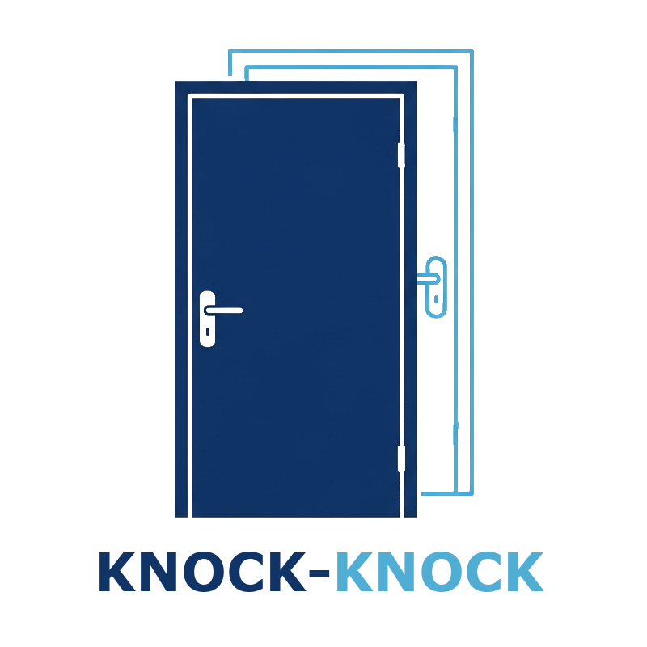

<p align="center"></p>

# Knock-Knock

**Knock-Knock** is a self-service web portal for managing IP allow lists via router APIs. It provides a secure and user-friendly interface for users to request temporary access and for administrators to manage access entries.
It is designed to sit behind a Cloudflare Zero-Trust Access application with a policy that allows specified email addresses access. This controls exactly who can use the self-service portal to add their IP to the allow list.
There is currently only support for Unifi routers, but templated for additional models.

---

## 🚀 Features
- User-facing interface to request IP access with expiration options
- Admin panel for viewing, filtering, and managing IP entries
- Background job to clean up expired IPs
- Integration with router APIs (e.g., Unifi)
- Rate-limited admin login
- Secure session and CSRF protection
- Designed to run behind Cloudflare Access for email-based access control

---

## 🖼️ Screenshots
### User Panel


### Admin Panel


---

## 🛡️ Cloudflare Access Integration
Knock-Knock is designed to be placed behind a **Cloudflare Access** rule that filters users by email address. This ensures that only authorized users can access the landing page and request IP access.

To configure:
1. Set up a Cloudflare Access policy for your domain.
2. Require authentication via email or identity provider.
3. Ensure the app receives the `Cf-Access-Authenticated-User-Email` header.

---

## 🛠️ Configuration & Customization Guide

### Environment Variables
These variables control how Knock-Knock interacts with your router and secures the app:

| Variable | Description |
|----------|-------------|
| `SECRET_KEY` | Used to secure sessions and CSRF protection. Generate a strong random string. |
| `ADMIN_PASSWORD` | Password for accessing the admin panel. |
| `ROUTER_TYPE` | Type of router integration (`unifi` or custom). |
| `UNIFI_BASE_URL` | Base URL of your Unifi controller (e.g., `https://192.168.1.1`). |
| `UNIFI_USERNAME` / `UNIFI_PASSWORD` | Credentials for Unifi API access. |
| `UNIFI_SITE` | Site name in Unifi (usually `default`). |
| `UNIFI_GROUP_ID` | Firewall group ID where IPs will be added. |
| `TITLE` | Custom title for the web interface. |
| `EXPIRATION_OPTIONS` | List of options to place in the expiration dropdown menu. Format: #a, where # is a quantity and u is the unit (d = day, w = week, m = month, y = year). 0f = forever. No spaces. Example: 3d,2w,1m,0f |

You can set these in your `docker-compose.yml` or a `.env` file.

---

## 🐳 Docker Deployment

### Build and Run
```bash
docker-compose up --build
```

Access the app at `http://localhost:9009`

### Dockerfile
- Uses `python:3.9-slim`
- Installs dependencies from `requirements.txt`
- Runs the app with Gunicorn on port 9009

### docker-compose.yml
- Maps port 9009
- Mounts volume for persistent SQLite storage
- Sets environment variables

---

## 🧭 Using the App

### For Users
- Visit the homepage (`http://localhost:9009`)
- Your IP and email (from Cloudflare headers) will be auto-detected
- Select an expiration time and click **“Knock Knock!”**
- Your IP will be added to the router’s allow list

### For Admins
- Click **“Admin Login”** and enter the password
- View all access entries
- Revoke or extend IP access using the admin panel

---

## 🔐 Security Features
- HTTPS-only cookies
- CSRF protection
- Rate-limited admin login
- Content Security Policy via Flask-Talisman
- Cloudflare Access integration for user authentication

---

## 🤝 Contributing
Pull requests are welcome! For major changes, please open an issue first to discuss what you would like to change.

---

## 📄 License
This project is licensed under the MIT License.
